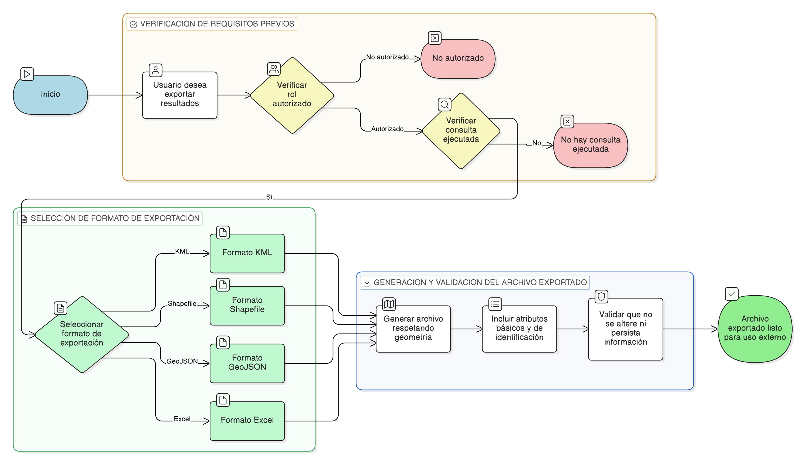

# HU-IDEAM-SNIF-REST-244

> **Identificador Historia de Usuario:** hu-ideam-snif-rest-244\
> **Nombre Historia de Usuario:** Exportación de resultados de la consulta espacial

> **Sistema de información:** Sistema Nacional de Información Forestal\
> **Módulo / subsistema:** Módulo de restauración\
> **Validador temático(s):** Raymond Alexander Jiménez Arteaga

## DESCRIPCIÓN HISTORIA DE USUARIO

> **Como:** usuario del sistema.\
> **Quiero:** exportar los resultados de la consulta espacial.\
> **Para:** utilizarlos en otros sistemas o análisis externos.

## CRITERIOS DE ACEPTACIÓN

1. **Formatos de exportación**\
   1.1 Los resultados deben poder exportarse en los siguientes formatos:
   - KML
   - Shapefile
   - GeoJSON
   - Excel

2. **Contenido del archivo exportado**\
   2.1 La exportación debe respetar la geometría resultante del cruce espacial.\
   2.2 El archivo exportado debe incluir atributos básicos y de identificación.

## ROLES

- **Administrador IDEAM:** Puede realizar la acción.
- **Registrador:** Puede realizar la acción.
- **Consulta:** Puede realizar la acción.

## RESTRICCIONES Y LÍMITES

- Solo se permite exportar resultados de una consulta ejecutada.
- La exportación respeta estrictamente la geometría resultante del cruce espacial.
- La exportación no altera ni persiste información en el sistema.

## DIAGRAMA DE FLUJO DEL PROCESO

