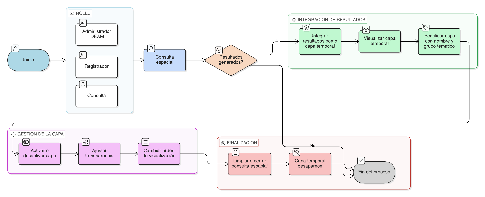

# HU-IDEAM-SNIF-REST-245

> **Identificador Historia de Usuario:** hu-ideam-snif-rest-245\
> **Nombre Historia de Usuario:** Integración de la consulta espacial con el visor

> **Sistema de información:** Sistema Nacional de Información Forestal\
> **Módulo / subsistema:** Módulo de restauración\
> **Validador temático(s):** Raymond Alexander Jiménez Arteaga

## DESCRIPCIÓN HISTORIA DE USUARIO

> **Como:** usuario del sistema.\
> **Quiero:** que los resultados de la consulta espacial se integren al visor.\
> **Para:** analizarlos en conjunto con otras capas cargadas.

## CRITERIOS DE ACEPTACIÓN

1. **Visualización como capa temporal**\
   1.1 Los resultados de la consulta espacial deben poder mostrarse como una capa temporal.

2. **Gestión de la capa resultante**\
   2.1 La capa resultante debe permitir:
   - Activarse o desactivarse.
   - Ajustar su transparencia.
   - Cambiar su orden de visualización.

3. **Identificación de la capa**\
   3.1 La capa debe identificarse con un nombre y un grupo temático correspondiente.

## ROLES

- **Administrador IDEAM:** Puede realizar la acción.
- **Registrador:** Puede realizar la acción.
- **Consulta:** Puede realizar la acción.

## RESTRICCIONES Y LÍMITES

- Los resultados se integran como una capa temporal no persistente.
- La capa desaparece al limpiar o cerrar la consulta espacial.
- La capa respeta las reglas de visualización del visor.
- La integración no afecta otras capas cargadas en el visor.

## DIAGRAMA DE FLUJO DEL PROCESO

