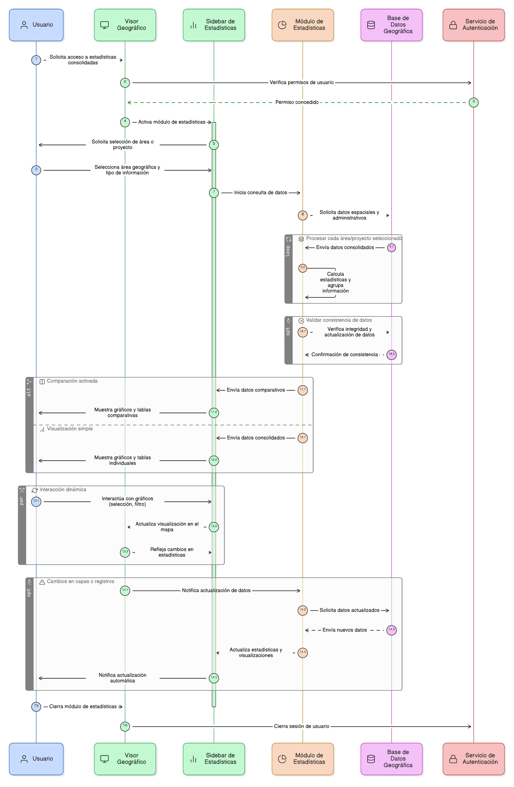

# ÉPICA 26: Estadísticas Espaciales Consolidadas en el Visor Geográfico

# 1. Descripción general

Esta épica define la funcionalidad de consulta y visualización de estadísticas espaciales consolidadas dentro del visor geográfico del sistema. Permite a los usuarios acceder a información resumida y comparativa de proyectos y áreas de restauración, generada a partir de selecciones espaciales o administrativas, y presentada mediante gráficos, tablas y visualizaciones integradas en el sidebar del visor.

El módulo de estadísticas consolidadas proporciona un soporte analítico confiable para la toma de decisiones y planificación territorial, facilitando la interpretación de datos complejos de manera clara y accesible. La información presentada es consistente con la base de datos geográfica oficial y se actualiza automáticamente según los cambios en las capas y registros de proyectos.

Esta épica soporta de manera transversal los procesos de seguimiento, monitoreo y evaluación de áreas de restauración, contribuyendo a la gestión integral del territorio y a la rendición de cuentas de los proyectos implementados.

## 2. Objetivo

- Disponer de un módulo dentro del visor geográfico que permita a los usuarios:
 -Consultar estadísticas espaciales consolidadas por proyectos y áreas de restauración.
- Filtrar y agrupar información según criterios espaciales (por área, polígono, coordenadas) o administrativos (departamento, municipio, vereda).
- Visualizar gráficos y tablas claras, interactivas y actualizadas, integradas al sidebar del visor.
- Comparar resultados entre áreas o proyectos seleccionados para apoyar análisis comparativos.
- Garantizar que la información mostrada sea consistente, confiable y trazable.
- Facilitar la toma de decisiones basada en evidencia espacial.

## 3. Historias de usuario asociadas

- [**HU-IDEAM-SNIF-REST-246:** Acceso a estadísticas espaciales desde el visor](EP-IDEAM-SNIF-REST-026/HU-IDEAM-SNIF-REST-246)
- [**HU-IDEAM-SNIF-REST-247:** Selección del ámbito espacial para estadísticas](EP-IDEAM-SNIF-REST-026/HU-IDEAM-SNIF-REST-247)
- [**HU-IDEAM-SNIF-REST-248:** Selección del tipo de información a consolidar](EP-IDEAM-SNIF-REST-026/HU-IDEAM-SNIF-REST-248)
- [**HU-IDEAM-SNIF-REST-249:** Cálculo de estadísticas consolidadas](EP-IDEAM-SNIF-REST-026/HU-IDEAM-SNIF-REST-249)
- [**HU-IDEAM-SNIF-REST-250:** Visualización de estadísticas mediante gráficos](EP-IDEAM-SNIF-REST-026/HU-IDEAM-SNIF-REST-250)
- [**HU-IDEAM-SNIF-REST-251:** Interacción entre gráficos y mapa](EP-IDEAM-SNIF-REST-026/HU-IDEAM-SNIF-REST-251)
- [**HU-IDEAM-SNIF-REST-252:** Actualización dinámica de estadísticas](EP-IDEAM-SNIF-REST-026/HU-IDEAM-SNIF-REST-252)
- [**HU-IDEAM-SNIF-REST-253:** Integración de estadísticas en el sidebar del visor](EP-IDEAM-SNIF-REST-026/HU-IDEAM-SNIF-REST-253)

## 4. Riesgos

- Presentación de estadísticas desactualizadas si las capas o registros asociados no se sincronizan correctamente.
- Sobrecarga visual del sidebar al mostrar múltiples gráficos o tablas simultáneamente.
- Interpretación incorrecta de los datos por usuarios si los gráficos no son claros o estandarizados.
- Problemas de rendimiento al procesar grandes volúmenes de datos espaciales.
- Acceso no autorizado a información sensible de proyectos o áreas de restauración.
- Falta de trazabilidad en la generación de estadísticas consolidadas.

## 5. Diagrama de secuencia

## 6. Wireframes / mockupso
