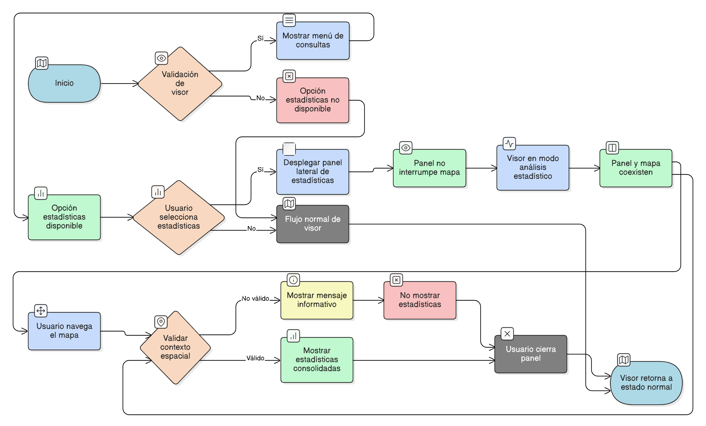

# HU-IDEAM-SNIF-REST-246

> **Identificador Historia de Usuario:** HU-IDEAM-SNIF-REST-246\
> **Nombre Historia de Usuario:** Acceso a estadísticas espaciales desde el visor geográfico

> **Sistema de información:** Sistema Nacional de Información Forestal\
> **Módulo / subsistema:** Módulo de restauración\
> **Validador temático(s):** Raymond Alexander Jiménez Arteaga

## DESCRIPCIÓN HISTORIA DE USUARIO

> **Como:** usuario del sistema (Administrador IDEAM, Registrador o Usuario Consulta).\
> **Quiero:** acceder a la opción de Estadísticas desde el módulo de consultas del visor geográfico.\
> **Para:** analizar información espacial consolidada asociada al territorio visualizado, apoyando el análisis territorial y la toma de decisiones.

## CRITERIOS DE ACEPTACIÓN

1. **Acceso a la funcionalidad**\
1.1 Desde el visor geográfico del módulo de restauración, el sistema debe mostrar la opción **“Estadísticas”** dentro del menú de **Consultas**.\
1.2 La opción debe estar disponible para los perfiles Administrador IDEAM, Registrador y Usuario Consulta.\
1.3 El acceso a la opción debe depender de que el visor se encuentre correctamente cargado.

2. **Despliegue del panel de estadísticas**\
2.1 Al seleccionar la opción **“Estadísticas”**, el sistema debe desplegar un panel lateral (sidebar).\
2.2 El panel debe abrirse sin interrumpir la visualización del mapa.\
2.3 El visor debe entrar en modo de análisis estadístico.

3. **Interacción con el visor geográfico**\
3.1 El panel de estadísticas debe coexistir con el mapa sin ocultarlo completamente.\
3.2 El usuario debe poder realizar acciones básicas de navegación (zoom, desplazamiento) mientras el panel está activo.\
3.3 El cierre del panel debe devolver el visor a su estado normal de consulta.

4. **Contexto inicial de análisis**\
4.1 Al abrir el panel, el sistema debe mostrar un mensaje informativo indicando que las estadísticas se generan a partir del territorio visualizado o seleccionado.\
4.2 No se deben mostrar estadísticas consolidadas si no existe un contexto espacial válido.

## ROLES

- **Administrador IDEAM**:	Puede realizar la acción.
- **Registrador**:	Puede realizar la acción.
- **Consulta**:	Puede realizar la acción.

## RESTRICCIONES Y LÍMITES

- Esta historia de usuario se limita al acceso y habilitación del módulo de estadísticas.
- No se permite la modificación de información desde el panel de estadísticas.
- No se realizan cálculos estadísticos avanzados en esta HU.
- La información mostrada es únicamente de carácter consultivo.
-El detalle de gráficos, filtros y comparaciones será definido en historias de usuario posteriores de la misma épica.

## DIAGRAMA DE FLUJO DEL PROCESO

