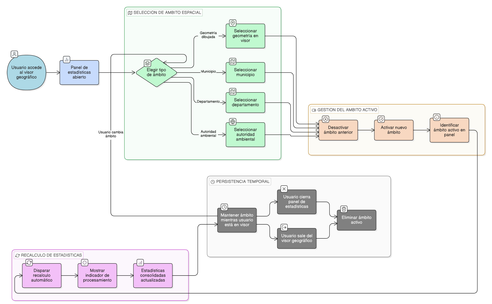

# HU-IDEAM-SNIF-REST-247

> **Identificador Historia de Usuario:** HU-IDEAM-SNIF-REST-247\
> **Nombre Historia de Usuario:** Selección del ámbito espacial para estadísticas

> **Sistema de información:** Sistema Nacional de Información Forestal\
> **Módulo / subsistema:** Módulo de restauración\
> **Validador temático(s):** Raymond Alexander Jiménez Arteaga

## DESCRIPCIÓN HISTORIA DE USUARIO

> **Como:** usuario del sistema (Administrador IDEAM, Registrador o Usuario Consulta).\
> **Quiero:** definir el ámbito espacial sobre el cual se calculan las estadísticas espaciales.\
> **Para:** obtener resultados consolidados ajustados a mi área de interés.

## CRITERIOS DE ACEPTACIÓN

1. **Opciones de selección del ámbito espacial**\
    1.1 El sistema debe permitir definir el ámbito espacial mediante las siguientes opciones:
    - Geometría dibujada directamente en el visor geográfico (polígono).
    - Municipio.
    - Departamento.
    - Autoridad ambiental.   
     
    1.2 Las opciones de selección deben estar disponibles dentro del panel de estadísticas del visor.

2. **Gestión del ámbito activo**\
    2.1 El sistema debe permitir que solo exista un ámbito espacial activo a la vez.\
    2.2 Al seleccionar un nuevo ámbito, el ámbito previamente activo debe desactivarse automáticamente.\
    2.3 El ámbito activo debe ser claramente identificado dentro del panel de estadísticas.

3. **Recalculo automático de estadísticas**\
    3.1 Cada vez que el usuario cambie el ámbito espacial, el sistema debe recalcular automáticamente las estadísticas espaciales consolidadas.\
    3.2 El recalculo debe ejecutarse sin requerir confirmación adicional del usuario.\
    3.3 Mientras se realiza el recalculo, el sistema debe mostrar un indicador de procesamiento.

4. **Persistencia temporal del ámbito**\
    4.1 El ámbito espacial seleccionado debe mantenerse activo mientras el usuario permanezca en el visor geográfico.\
    4.2 Al cerrar el panel de estadísticas o salir del visor, el ámbito activo no debe persistir como configuración permanente.

## ROLES

- **Administrador IDEAM**:	Puede realizar la acción.
- **Registrador**:	Puede realizar la acción.
- **Consulta**:	Puede realizar la acción.

## RESTRICCIONES Y LÍMITES

- No se permite la definición simultánea de múltiples ámbitos espaciales.
- La geometría dibujada es de uso exclusivo para análisis estadístico y no se almacena como registro permanente.
- No se permite editar capas o geometrías oficiales desde esta funcionalidad.
- El cálculo estadístico depende de la disponibilidad y vigencia de la información espacial cargada en el sistema.

## DIAGRAMA DE FLUJO DEL PROCESO

