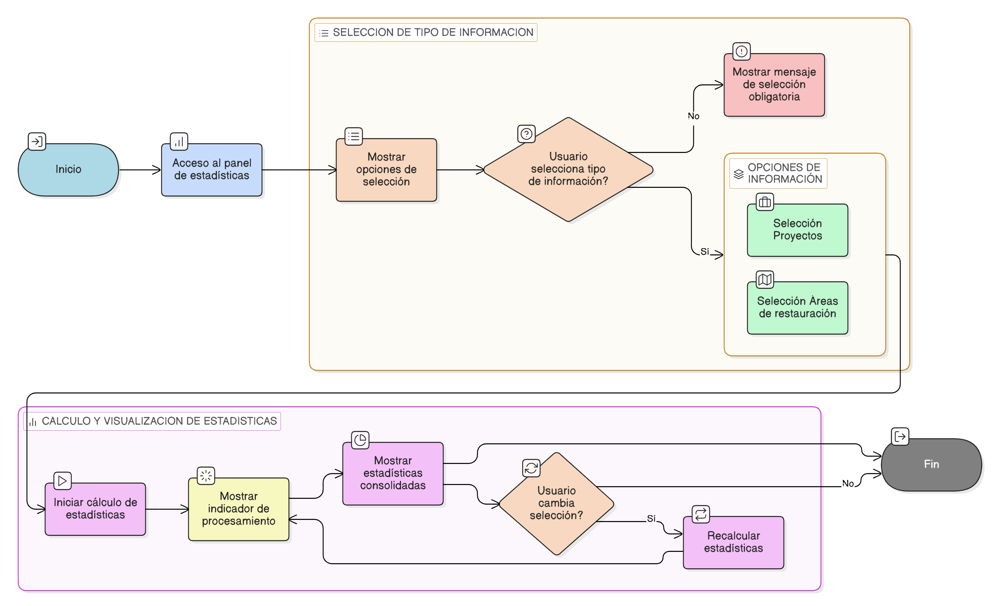

# HU-IDEAM-SNIF-REST-248

> **Identificador Historia de Usuario:** HU-IDEAM-SNIF-REST-248
> **Nombre Historia de Usuario:** Selección del tipo de información a consolidar

> **Sistema de información:** Sistema Nacional de Información Forestal\
> **Módulo / subsistema:** Módulo de restauración\
> **Validador temático(s):** Raymond Alexander Jiménez Arteaga

## DESCRIPCIÓN HISTORIA DE USUARIO

> **Como:** usuario del sistema (Administrador IDEAM, Registrador o Usuario Consulta).\
> **Quiero:** seleccionar el tipo de información sobre el cual se calculan las estadísticas espaciales consolidadas.\
> **Para:** enfocar el análisis según el tipo de información requerida.

## CRITERIOS DE ACEPTACIÓN

1. **Opciones de tipo de información**\
1.1 El panel de estadísticas debe permitir seleccionar el tipo de información a consolidar mediante las opciones:
- Proyectos.
- Áreas de restauración.                         
1.2 Las opciones deben presentarse de forma clara y mutuamente excluyente.

2. **Selección obligatoria**\
2.1 La selección del tipo de información debe ser obligatoria para el cálculo de estadísticas.\
2.2 Mientras no se seleccione un tipo de información, el sistema no debe mostrar resultados estadísticos.\
2.3 El sistema debe indicar visualmente que la selección es requerida.

3. **Recalculo automático de indicadores**\
3.1 Al cambiar el tipo de información seleccionado, el sistema debe recalcular automáticamente las estadísticas e indicadores asociados.\
3.2 El recalculo debe realizarse sin requerir confirmación adicional del usuario.\
3.3 Durante el recalculo, el sistema debe mostrar un indicador de procesamiento.

4. **Consistencia del análisis**\
4.1 El tipo de información seleccionado debe aplicarse a todo el conjunto de estadísticas mostradas en el panel.\
4.2 No se debe permitir la visualización simultánea de estadísticas de proyectos y áreas de restauración.

## ROLES

- **Administrador IDEAM**:	Puede realizar la acción.
- **Registrador**:	Puede realizar la acción.
- **Consulta**:	Puede realizar la acción.

## RESTRICCIONES Y LÍMITES

- No se permite seleccionar más de un tipo de información a la vez.
- Esta funcionalidad no modifica ni crea registros de proyectos o áreas de restauración.
Los indicadores disponibles dependen del tipo de información seleccionado.
- La definición específica de los indicadores se aborda en historias de usuario posteriores de la épica.
- El cálculo estadístico está condicionado a la disponibilidad de información espacial vigente en el sistema.

## DIAGRAMA DE FLUJO DEL PROCESO

