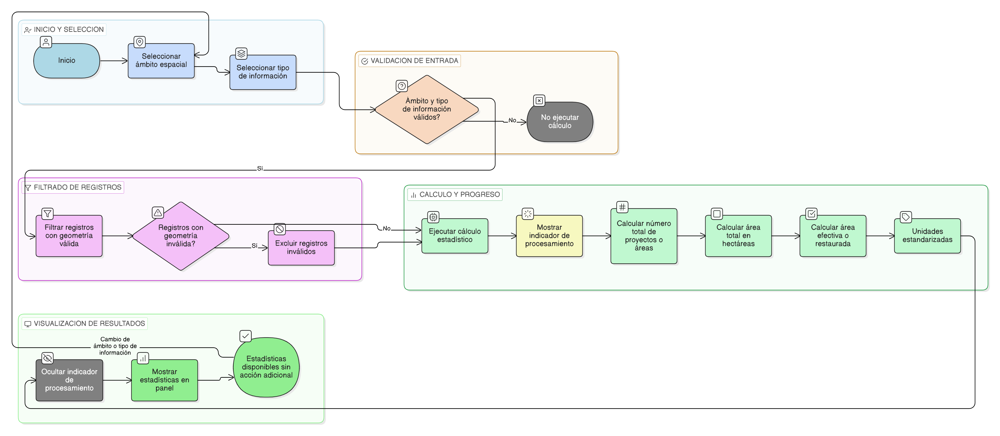

# HU-IDEAM-SNIF-REST-249

> **Identificador Historia de Usuario:** HU-IDEAM-SNIF-REST-249\
> **Nombre Historia de Usuario:** Cálculo de estadísticas espaciales consolidadas

> **Sistema de información:** Sistema Nacional de Información Forestal\
> **Módulo / subsistema:** Módulo de restauración\
> **Validador temático(s):** Raymond Alexander Jiménez Arteaga

## DESCRIPCIÓN HISTORIA DE USUARIO

> **Como:** usuario del sistema (Administrador IDEAM, Registrador o Usuario Consulta).\
> **Quiero:** que el sistema calcule estadísticas espaciales consolidadas a partir del ámbito espacial seleccionado.\
> **Para:** comprender la magnitud y distribución de la información espacial asociada.

## CRITERIOS DE ACEPTACIÓN

1. **Ejecución del cálculo estadístico**\
1.1 El sistema debe ejecutar el cálculo de estadísticas utilizando el ámbito espacial activo definido por el usuario.\
1.2 El cálculo debe realizarse automáticamente cuando exista un ámbito válido y un tipo de información seleccionado.

2. **Estadísticas mínimas requeridas**\
2.1 El sistema debe calcular, como mínimo, las siguientes estadísticas consolidadas:
- Número total de proyectos o áreas de restauración.
- Área total en hectáreas (ha).
- Área efectiva o restaurada, cuando aplique según el tipo de información seleccionado.                       
2.2 Las unidades de medida deben mostrarse de forma clara y estandarizada.

3. **Validación de registros considerados**\
3.1 El sistema debe considerar únicamente registros que cuenten con geometría válida.\
3.2 Los registros con geometrías inválidas, nulas o inconsistentes no deben incluirse en el cálculo.

4. **Indicador de procesamiento**\
4.1 Durante la ejecución del cálculo, el sistema debe mostrar un indicador visual de procesamiento.\
4.2 El indicador debe mantenerse visible hasta que los resultados estén completamente disponibles.

5. **Disponibilidad de resultados**\
5.1 Una vez finalizado el cálculo, las estadísticas consolidadas deben mostrarse inmediatamente en el panel de estadísticas.\
5.2 El sistema no debe requerir acciones adicionales del usuario para visualizar los resultados.

## ROLES

- **Administrador IDEAM**:	Puede realizar la acción.
- **Registrador**:	Puede realizar la acción.
- **Consulta**:	Puede realizar la acción.

## RESTRICCIONES Y LÍMITES

- No se permite la ejecución manual del cálculo fuera del flujo definido en el panel de estadísticas.
- El cálculo depende de la disponibilidad y consistencia de la información espacial cargada en el sistema.
- Esta historia de usuario no define visualizaciones gráficas ni desagregaciones, las cuales se abordan en HU posteriores.
- El proceso de cálculo no modifica ni persiste información en los registros fuente.
- El rendimiento del cálculo puede verse afectado por el volumen de datos espaciales involucrados.

## DIAGRAMA DE FLUJO DEL PROCESO

