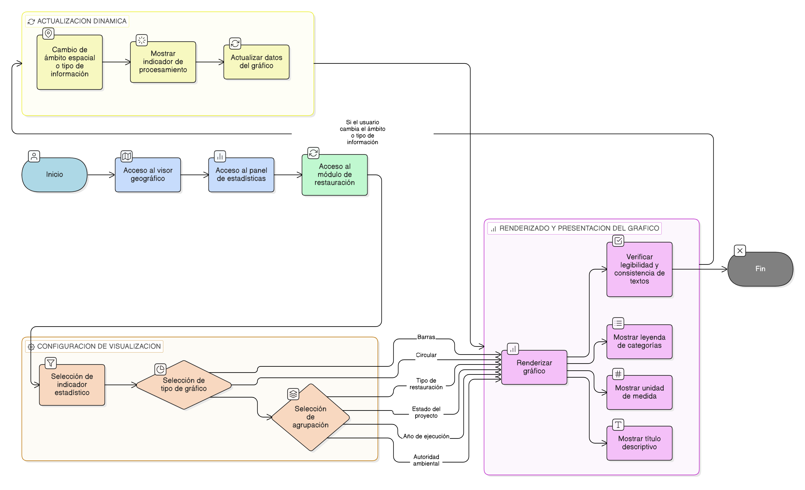

# HU-IDEAM-SNIF-REST-250

> **Identificador Historia de Usuario:** HU-IDEAM-SNIF-REST-250\
> **Nombre Historia de Usuario:** Visualización de estadísticas mediante gráficos

> **Sistema de información:** Sistema Nacional de Información Forestal\
> **Módulo / subsistema:** Módulo de restauración\
> **Validador temático(s):** Raymond Alexander Jiménez Arteaga

## DESCRIPCIÓN HISTORIA DE USUARIO

> **Como:** usuario del sistema (Administrador IDEAM, Registrador o Usuario Consulta).\
> **Quiero:** visualizar las estadísticas espaciales consolidadas mediante gráficos.\
> **Para:** interpretar de forma clara y sencilla la información espacial generada.

## CRITERIOS DE ACEPTACIÓN

1. **Visualización gráfica en el panel de estadísticas**\
1.1 El sistema debe mostrar las estadísticas consolidadas dentro del panel lateral (sidebar) del visor geográfico.\
1.2 La visualización debe realizarse mediante componentes gráficos integrados al visor, sin abrir ventanas externas.

2. **Tipos de gráficos soportados**
2.1 El sistema debe permitir visualizar las estadísticas mediante, como mínimo:
- Gráficos de barras.
- Gráficos circulares o de distribución.                    
2.2 El tipo de gráfico utilizado debe ser acorde con la naturaleza del indicador mostrado.

3. **Agrupación de la información**\
3.1 Los gráficos deben permitir agrupar la información estadística según los siguientes criterios:
- Tipo de restauración.
- Estado del proyecto.
- Año de ejecución.
- Autoridad ambiental.                       
3.2 Cada gráfico debe mostrar únicamente una agrupación a la vez.

4. **Elementos obligatorios del gráfico**\
4.1 Cada gráfico presentado debe incluir obligatoriamente:
- Título descriptivo.
- Leyenda clara de categorías.
- Unidad de medida correspondiente al indicador.                      
4.2 Los textos deben ser legibles y consistentes con los estándares del sistema.

5. **Actualización dinámica de gráficos**\
5.1 Los gráficos deben actualizarse automáticamente cuando cambie el ámbito espacial o el tipo de información seleccionado.\
5.2 Durante la actualización, el sistema debe mostrar un indicador de procesamiento.

## ROLES

- **Administrador IDEAM**:	Puede realizar la acción.
- **Registrador**:	Puede realizar la acción.
- **Consulta**:	Puede realizar la acción.

## RESTRICCIONES Y LÍMITES

- No se permite la edición de datos desde los gráficos.
- Los gráficos son de carácter consultivo y no generan cambios en la información fuente.
- La disponibilidad de agrupaciones depende de los datos existentes en el sistema.
- Esta historia de usuario no contempla exportación de gráficos o datos estadísticos.
- El rendimiento de la visualización puede verse afectado por el volumen de información procesada.

## DIAGRAMA DE FLUJO DEL PROCESO

