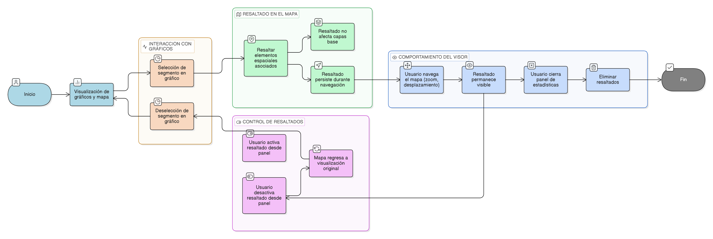

# HU-IDEAM-SNIF-REST-251

> **Identificador Historia de Usuario:** HU-IDEAM-SNIF-REST-251\
> **Nombre Historia de Usuario:** Interacción entre gráficos y mapa

> **Sistema de información:** Sistema Nacional de Información Forestal\
> **Módulo / subsistema:** Módulo de restauración\
> **Validador temático(s):** Raymond Alexander Jiménez Arteaga

## DESCRIPCIÓN HISTORIA DE USUARIO

> **Como:** usuario del sistema (Administrador IDEAM, Registrador o Usuario Consulta).\
> **Quiero:** que la interacción con los gráficos estadísticos se refleje dinámicamente en el mapa del visor geográfico.\
> **Para:** analizar de manera espacial los resultados estadísticos consolidados.

## CRITERIOS DE ACEPTACIÓN

1. **Sincronización entre gráficos y mapa**\
1.1 Al seleccionar un valor, categoría o segmento dentro de un gráfico, el sistema debe resaltar en el mapa los elementos espaciales asociados.\
1.2 El resaltado debe aplicarse únicamente a los registros que hacen parte del resultado estadístico seleccionado.

2. **Control de resaltados**\
2.1 El sistema debe permitir al usuario activar o desactivar el resaltado espacial desde el panel de estadísticas.\
2.2 Al desactivar el resaltado, el mapa debe regresar a su visualización original.

3. **Comportamiento del visor**\
3.1 El resaltado aplicado no debe modificar ni afectar las capas base del visor geográfico.\
3.2 El comportamiento debe ser reversible y no persistente al cerrar el panel de estadísticas.

4. **Compatibilidad con navegación**\
4.1 El usuario debe poder continuar utilizando las herramientas de navegación del mapa (zoom, desplazamiento) mientras el resaltado está activo.\
4.2 El resaltado debe mantenerse visible durante la interacción con el mapa, salvo que el usuario lo desactive.

## ROLES

- **Administrador IDEAM**:	Puede realizar la acción.
- **Registrador**:	Puede realizar la acción.
- **Consulta**:	Puede realizar la acción.

## RESTRICCIONES Y LÍMITES

- El resaltado es únicamente visual y no altera los datos ni las geometrías originales.
- No se permite la edición de elementos espaciales desde esta funcionalidad.
- El comportamiento depende de la disponibilidad de geometrías válidas asociadas a los registros.
- Esta historia de usuario no contempla análisis espacial avanzado (intersecciones, buffers, etc.).
- El rendimiento del resaltado puede verse afectado por el volumen de elementos seleccionados.

## DIAGRAMA DE FLUJO DEL PROCESO

