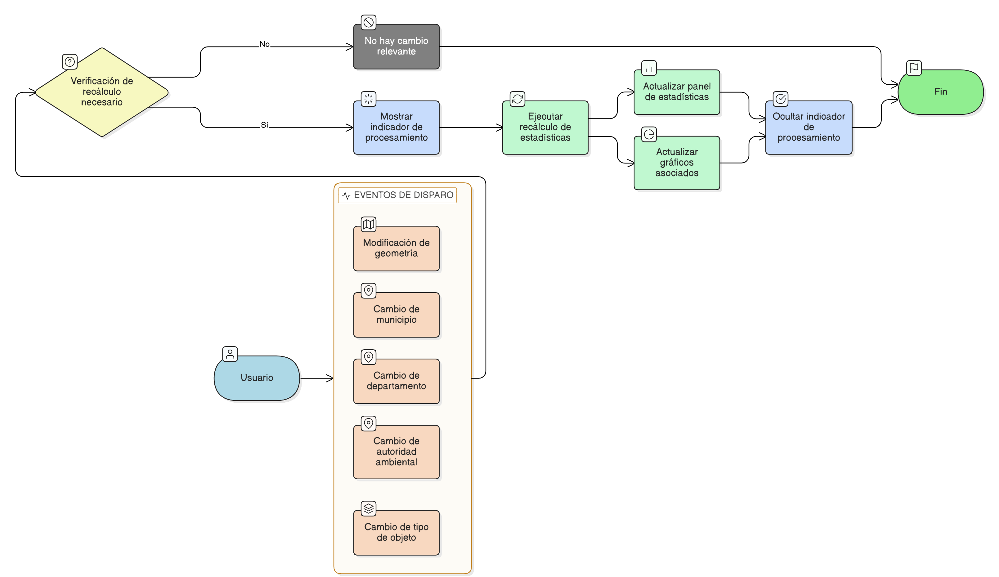

# HU-IDEAM-SNIF-REST-252

> **Identificador Historia de Usuario:** HU-IDEAM-SNIF-REST-252\
> **Nombre Historia de Usuario:** Actualización dinámica de estadísticas espaciales

> **Sistema de información:** Sistema Nacional de Información Forestal\
> **Módulo / subsistema:** Módulo de restauración\
> **Validador temático(s):** Raymond Alexander Jiménez Arteaga

## DESCRIPCIÓN HISTORIA DE USUARIO

> **Como:** usuario del sistema (Administrador IDEAM, Registrador o Usuario Consulta).\
> **Quiero:** que las estadísticas espaciales consolidadas se actualicen dinámicamente.\
> **Cuando:** cambio el ámbito espacial o el tipo de información seleccionado.

## CRITERIOS DE ACEPTACIÓN

1. **Eventos que disparan el recálculo**\
1.1 El sistema debe recalcular automáticamente las estadísticas cuando ocurra alguno de los siguientes eventos:
- Modificación de la geometría del ámbito espacial.
- Cambio de municipio, departamento o autoridad ambiental.
- Cambio del tipo de objeto (proyectos o áreas de restauración).

2. **Actualización automática**\
2.1 El recálculo debe ejecutarse sin requerir confirmación adicional del usuario.\
2.2 Los resultados actualizados deben reflejarse inmediatamente en el panel de estadísticas y en los gráficos asociados.

3. **Optimización de recálculos**\
3.1 El sistema debe evitar recálculos innecesarios cuando no existan cambios reales en el ámbito espacial o en el tipo de información.\
3.2 Si el usuario realiza acciones que no afectan el contexto del análisis, las estadísticas deben mantenerse sin recalcularse.

4. **Indicador de procesamiento**\
4.1 Durante el proceso de actualización, el sistema debe mostrar un indicador visual de procesamiento.\
4.2 El indicador debe desaparecer automáticamente una vez el recálculo haya finalizado.

## ROLES

- **Administrador IDEAM**:	Puede realizar la acción.
- **Registrador**:	Puede realizar la acción.
- **Consulta**:	Puede realizar la acción.

## RESTRICCIONES Y LÍMITES

- El recálculo dinámico no debe afectar el rendimiento general del visor geográfico.
- No se deben generar múltiples procesos de cálculo simultáneos para el mismo contexto de análisis.
- La actualización de estadísticas depende de la disponibilidad y consistencia de la información espacial.
- Esta historia de usuario no contempla persistencia de resultados estadísticos.
- El comportamiento dinámico se limita al contexto activo del visor.

## DIAGRAMA DE FLUJO DEL PROCESO

