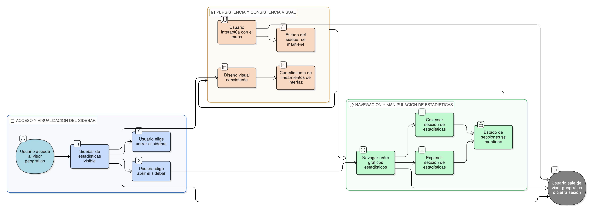

# HU-IDEAM-SNIF-REST-253

> **Identificador Historia de Usuario:** HU-IDEAM-SNIF-REST-253\
> **Nombre Historia de Usuario:** Integración de estadísticas en el sidebar del visor

> **Sistema de información:** Sistema Nacional de Información Forestal\
> **Módulo / subsistema:** Módulo de restauración\
> **Validador temático(s):** Raymond Alexander Jiménez Arteaga

## DESCRIPCIÓN HISTORIA DE USUARIO

> **Como:** usuario del sistema (Administrador IDEAM, Registrador o Usuario Consulta).\
> **Quiero:** que las estadísticas espaciales consolidadas se presenten integradas en el sidebar del visor geográfico.\
> **Para:** analizarlas de forma continua sin salir del contexto del mapa.

## CRITERIOS DE ACEPTACIÓN

1. **Integración del panel de estadísticas**\
    1.1 El sistema debe presentar las estadísticas consolidadas dentro del sidebar del visor geográfico.\
    1.2 El sidebar debe permitir visualizar estadísticas sin reemplazar ni bloquear el mapa.

2. **Navegación y organización del contenido**\
    2.1 El sidebar debe permitir navegar entre diferentes gráficos estadísticos.\
    2.2 El sistema debe permitir colapsar y expandir secciones del panel de estadísticas.\
    2.3 El estado de las secciones (colapsadas o expandidas) debe mantenerse durante la sesión activa.

3. **Persistencia del estado del panel**\
    3.1 El panel de estadísticas debe mantener su estado al realizar acciones de navegación en el mapa (zoom, desplazamiento).\
    3.2 La interacción con el mapa no debe reiniciar ni recargar el contenido del sidebar.

4. **Consistencia visual y de diseño**\
    4.1 El diseño visual del sidebar de estadísticas debe ser consistente con el resto del visor geográfico.\
    4.2 Los estilos, tipografías y controles deben cumplir los lineamientos de interfaz definidos para el sistema.

## ROLES

- **Administrador IDEAM**:	Puede realizar la acción.
- **Registrador**:	Puede realizar la acción.
- **Consulta**:	Puede realizar la acción.

## RESTRICCIONES Y LÍMITES

- El sidebar es de uso exclusivo para - visualización y análisis, no para edición de información.
- No se deben abrir ventanas emergentes externas para mostrar estadísticas.
- El contenido del panel depende del ámbito espacial y tipo de información seleccionados.
- El estado del sidebar no persiste entre sesiones del sistema.
- Esta historia de usuario no contempla exportación ni descarga de información estadística.

## DIAGRAMA DE FLUJO DEL PROCESO

